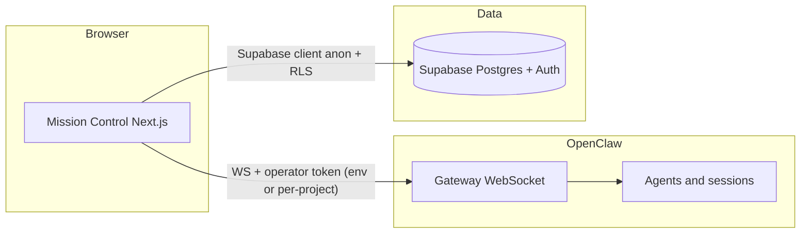

# Mission Control

**Mission Control** is a Next.js operator console for running **OpenClaw** alongside **Supabase**: one place to steer projects, talk to a **Chief of Staff** assistant over the Gateway, manage **agents**, watch **ops/health**, and run **marketing workflows** (leads → enrichment → email drafts) with full provenance stored in Postgres.

**Repo:** [github.com/HypeGamer007/mission-control](https://github.com/HypeGamer007/mission-control) · default branch **`main`**.

---

## How the pieces fit together



| Layer | Role |
|--------|------|
| **Mission Control** | Auth’d UI: teams/projects, CoS chat dock, agent CRUD, ops, workflows. |
| **OpenClaw Gateway** | Single WebSocket entry: `connect`, JSON-RPC `req`/`res`, `event` stream (`hello-ok`, `tick`, `session.message`, `chat`, `heartbeat`, …). |
| **Supabase** | Long-lived org data: profiles, teams, projects, leads, outreach drafts, agent run records — with **RLS** keyed off membership. |

Mission Control’s **`OpenClawGatewayClient`** ([`src/lib/openclaw/gatewayClient.ts`](src/lib/openclaw/gatewayClient.ts)) speaks that protocol: connect with `minProtocol`/`maxProtocol` **3**, operator role, optional bearer token in `connect.params.auth`, then `rpc(method, params)` for any Gateway method.

---

## What the app does today

| Area | Purpose |
|------|---------|
| **Auth** | Supabase Auth; [`profiles`](supabase/migrations/20260417120001_init.sql) + middleware for session. |
| **Projects** | Teams (`mc_teams`), members (`mc_team_members`), projects (`mc_projects`) with optional per-project **`openclaw_gateway_ws_url`** and **`openclaw_operator_token`** (falls back to env when unset). |
| **Chief of Staff (CoS)** | Dock UI: WebSocket to Gateway, session key `cos_<projectIdWithoutHyphens>`, RPCs `sessions.create`, `sessions.messages.subscribe`, `sessions.send`, `chat.history`; listens for `session.message` and `chat`. Loads URL/token from the selected project when saved. |
| **Agents** | **`mc_agent_teams`** per project map to OpenClaw `workspace` strings; default teams (`general`, `outbound`, `ops`) are created on new projects. Lists/creates/deletes via `agents.list`, `agents.create`, `agents.delete`. |
| **Ops** | Same Gateway connection pattern as other screens: pick a **project**, then Gateway introspection (`health`, `status`, `system-presence`, `last-heartbeat`, `logs.tail`, `set-heartbeats`); subscribes to `tick` and `heartbeat`. |
| **Workflows** | Creates lead + source in Supabase, opens Gateway session `wf_<leadId>`, sends structured prompt via `chat.send`, parses JSON result, writes `mc_lead_enrichments`, `mc_outreach_messages`, `mc_agent_runs`. |
| **Leads** | CRUD-style lead entry tied to a project (`mc_leads`). |

Table names use the **`mc_` prefix** so Mission Control can share a Supabase project with other apps (e.g. an existing `public.team_members` table) without collisions.

---

## OpenClaw: methods and events this repo uses

These are the main **RPC methods** invoked from the UI (exact availability depends on your Gateway version and config):

| Method | Where used | Notes |
|--------|------------|--------|
| `connect` | Implicit (first frame after WS open) | Sent by `OpenClawGatewayClient`. |
| `sessions.create` | CoS dock, Workflows | Creates named session (`cos_…`, `wf_…`). |
| `sessions.messages.subscribe` | CoS dock, Workflows | Real-time message stream. |
| `sessions.send` | CoS dock | User messages to CoS. |
| `chat.history` | CoS dock | Bounded history for display. |
| `chat.send` | Workflows | Lead enrich + email draft turn (`deliver: false`, wait for `chat` `final`). |
| `agents.list` / `agents.create` / `agents.delete` | Agents page | Workspace-scoped agents. |
| `health` / `status` / `system-presence` / `last-heartbeat` / `logs.tail` / `set-heartbeats` | Ops page | Debugging and presence. |

**Events** subscribed to in code include: `hello-ok`, `tick`, `shutdown`, `session.message`, `chat`, `heartbeat`.

Gateway **policy** (e.g. `tickIntervalMs`, payload limits) comes back on `hello-ok` and drives reconnect and tick watchdog behavior in the client.

---

## Agents: what exists now vs what we’re building toward

**Today (Gateway agents)**  
The **Agents** screen treats OpenClaw **agents** as Gateway-managed entities: you assign an **agent team** (stored in `mc_agent_teams`) so `agents.create` uses that team’s workspace string. New projects get default teams via a DB trigger; use **`mc_seed_default_agent_teams`** if you need to re-seed. OpenClaw behavior depends on your deployment and agent packs.

**Recommended agent lineup (to implement / standardize in OpenClaw)**  

| Agent (concept) | Role | Ties to Mission Control |
|-----------------|------|-------------------------|
| **Chief of Staff** | Strategy, prioritization, comms with you | CoS dock sessions (`cos_…`), `sessions.*`, `chat.*`. |
| **Sourcing** | Find and qualify leads from URLs/communities | Future: automate `mc_leads` + `mc_lead_sources`. |
| **Enrichment** | Research + structured summaries | Workflows already persist to `mc_lead_enrichments`. |
| **Outreach / SDR** | Draft and iterate emails | Drafts in `mc_outreach_messages`, sequences in `mc_outreach_sequences`. |
| **Ops** | Health, logs, heartbeats | Ops page RPCs + events. |

Mission Control will keep **orchestrating** these via Gateway sessions and RPCs while **Supabase** remains the **system of record** for CRM-style data and audit (`mc_audit_events`, `mc_agent_runs`).

---

## Environment variables

All variables are validated in [`src/lib/env.ts`](src/lib/env.ts). **Do not commit real secrets.**

| Variable | Required | Purpose |
|----------|----------|---------|
| `NEXT_PUBLIC_SUPABASE_URL` | Yes | Supabase project URL. |
| `NEXT_PUBLIC_SUPABASE_ANON_KEY` | Yes | Supabase anon (public) key; RLS enforced. |
| `NEXT_PUBLIC_OPENCLAW_GATEWAY_WS_URL` | Yes | Default Gateway WebSocket URL (`ws://` or `wss://`). Each project can override with **`openclaw_gateway_ws_url`** in `mc_projects`. |
| `NEXT_PUBLIC_OPENCLAW_OPERATOR_TOKEN` | Optional | Default operator token for `connect` auth. Each project can store **`openclaw_operator_token`** in `mc_projects`; UI uses **Reload from project** to pull saved values. |
| `SUPABASE_SERVICE_ROLE_KEY` | Optional | Only for future server-only admin automation; **never** expose to the browser. |

**Mock template:** copy [`.env.example`](.env.example) → **`.env.local`** and replace every `MOCK` / placeholder. `.env.local` is listed in `.gitignore`.

**Supabase MCP note:** Cursor’s Supabase MCP only sees projects your linked account can access. If your Mission Control database lives under another org or ref (for example a project that returns “permission denied” in MCP), copy **Project URL** and the **anon** key from **Supabase Dashboard → Project Settings → API** into `.env.local` manually. This repo does not commit `.env.local`.

---

## Prereqs

- **Node.js** 22+
- **npm** (or pnpm/yarn)
- A **Supabase** project with migrations applied (see [`supabase/migrations/`](supabase/migrations/) — run **all** files in version order, or `supabase db push` after `supabase link`)
- An **OpenClaw Gateway** reachable from the browser (and operator token if required)

---

## Setup

```bash
git clone https://github.com/HypeGamer007/mission-control.git
cd mission-control
npm install
cp .env.example .env.local
# Edit .env.local with real Supabase + Gateway values (never commit .env.local)
npm run dev
```

Apply migrations via **`npx supabase login`**, **`npx supabase link --project-ref <ref>`**, **`npx supabase db push`**, or paste each SQL file in order into the Supabase **SQL editor**. Migration filenames must use **unique version prefixes** (e.g. `20260417120001_…`) so the CLI does not merge multiple files into one version.

**OpenClaw connection in the UI:** set Gateway URL and operator token on **Projects** (or rely on env defaults). CoS, Agents, Workflows, and Ops support **Reload from project** and **Paste token** so you do not re-type credentials every session.

---

## Scripts

| Command | Description |
|---------|-------------|
| `npm run dev` | Next.js dev server |
| `npm run build` / `npm run start` | Production build / start |
| `npm run lint` | ESLint |
| `npm run typecheck` | TypeScript `--noEmit` |

---

## Security notes

- Use the **anon** key in the client only; RLS policies guard `mc_*` tables.
- Treat **`NEXT_PUBLIC_*`** as **public** (they ship to the browser). Do not put **service role** keys in any `NEXT_PUBLIC_` variable.
- **Per-project operator tokens** in `mc_projects` are readable by **project members** via the Supabase client when connecting—same trust model as any shared API key. For stricter isolation, use a server proxy, Vault, or Edge Functions instead of long-lived tokens in Postgres.
- Prefer **`wss://`** and locked-down Gateway auth in any shared or production environment.

---

## Contributing / git

Optional: configure `git config user.name` and `git config user.email` for meaningful commits.
